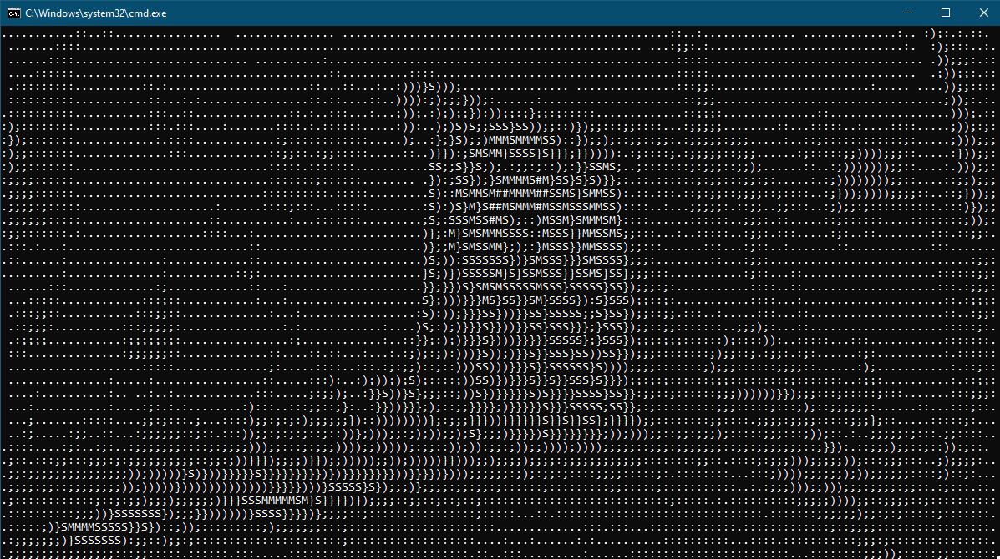

# Windows CMD BadApple
This python script shows fideos in Window's Console. Videos are taken from appropriate folder. 

How to run:

1. Clone repo.
2. Run bat file.
3. Write relevant number.
4. (Optional) Add your own videos in appropriate folder.

